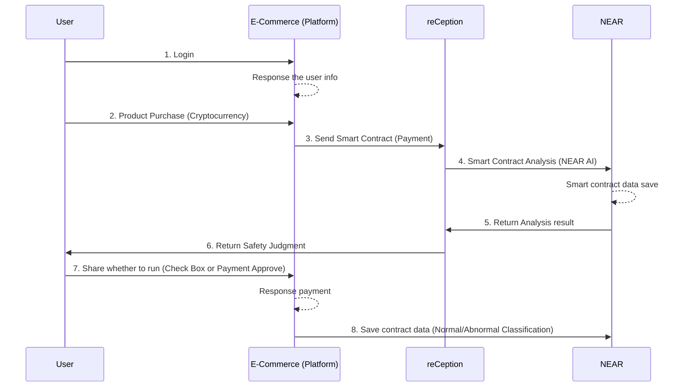
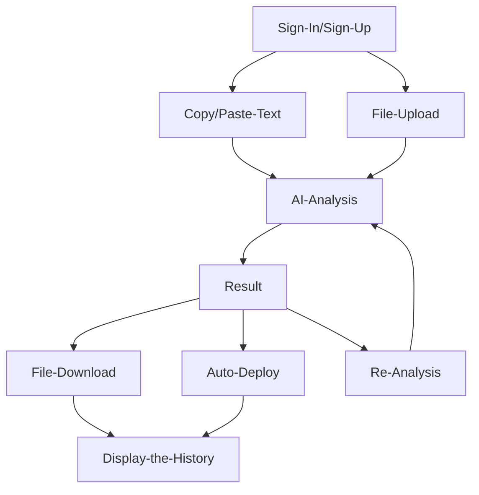

# Contents
- [Over view](https://github.com/Julius-Ky/reCeption/blob/main/README.md#reception-web30-recaptcha)
- [Key Features](https://github.com/Julius-Ky/reCeption/blob/main/README.md#key-features)
- [Model Process](https://github.com/Julius-Ky/reCeption/blob/main/README.md#model-process)
- [Journey](https://github.com/Julius-Ky/reCeption/blob/main/README.md#Journey)
- [Competition](https://github.com/Julius-Ky/reCeption/blob/main/README.md#Competition)

## [reCEPTION](https://reception-seven.vercel.app/) (Web3.0 reCAPTCHA)

reCEPTION is an **`AI-powered security platform`** that offers functionality similar to **reCAPTCHA**, providing automated verification solutions for both **`Web2 and Web3 environments`**. 
The project aims to enhance the **`security`** and **`quality of smart contracts`** and **`provide automated validation solutions for users and developers`**.

[Demo Video]() | [Smart Contract]()

### Reference training data
- [A survey of attacks on Ethereum smart contracts](https://drive.google.com/file/d/1iKK2nI9jQnyWflCkc1lR0q_pRUKyD5wk/view?usp=sharing)
- [Vulnerabilities #1](https://kadenzipfel.github.io/smart-contract-vulnerabilities/)
- [Vulnerabilities #2](https://arxiv.org/html/2409.02139v1)
- [Vulnerabilities #3](https://www.4byte.directory/)

## Key Features
1. **AI-Based Smart Contract Analysis**:
    - Users upload their smart contract code for analysis, where AI identifies security vulnerabilities, code flaws, and potential scams.
2. **Automated Security Checks and Corrections**:
    - Based on the analysis, the AI suggests and implements modifications, including security patches and performance optimizations.
    - Provides a feature to automatically deploy the modified code within the platform.
3. **Detailed Reporting**:
    - Generates comprehensive reports detailing the issues found, modifications made, and explanations to help users understand improvements.
    - Reports are available for download in CSV and PDF formats.
4. **Admin Console**:
    - An admin console allows administrators to set up and manage reCeption features on their own websites.
    - Supports reCAPTCHA-like functionality for security validation on web pages.
5. **API Provision**:
    - Offers API access to analysis results and data, enabling e-commerce platforms or Web3 applications to use these as security solutions.

## Model Process

## Journey
### reCEPTION Diagram

1. **Login**: The user logs into the E-Commerce platform.
   - **Response the user info**: The E-Commerce platform processes the logged-in user information.
2. **Product Purchase**: The user purchases a product using cryptocurrency.
3. **Send Smart Contract**: The E-Commerce platform sends the smart contract for payment to reCeption.
4. **Smart Contract Analysis**: reCeption analyzes the smart contract using NEAR AI.
   - **Smart contract data save**: NEAR saves the not analysis and analyzed smart contract data.
5. **Return Analysis result**: NEAR returns the analysis result to reCeption.
6. **Return Safety Judgment**: reCeption sends the safety judgment result back to the user.
7. **Share whether to run**: The user decides the next step via a checkbox or payment approval.
   - **Response payment**: The E-Commerce platform internally processes the payment response.
8. **Save contract data**: The E-Commerce platform saves the smart contract data on NEAR, categorized as normal/abnormal.

### Platform Journey

### User Journey

## Competition
>**❗**We are different from them.

<a href="https://www.walletguard.app/" height="5" width="10" target="_blank">
	
<a><a href="https://www.anchain.ai/" height="5" width="10" target="_blank">
	
<a>

- We do not secure the wallet itself, but the **`contract code itself`**.
- We do not detect transactions that occur through contracts via AI by being installed in the wallet itself, but we analyze the contract code itself that generates transactions by loading the contract code **`from the website itself through AI`**.
- We are not restricted by the wallet, and we analyze only the contract code itself to find vulnerabilities in the code and inform the user of the presence or absence of transactions. Furthermore, if we **`modify and supplement the contract code, we provide a report on the analysis results to prevent secondary crimes`**.
- Even if users do not download our service separately as a browser extension or wallet snap, if the **`website admin generally install`** and operate our **`API service`**, anyone can easily use our service to make **`safe transactions`**.
